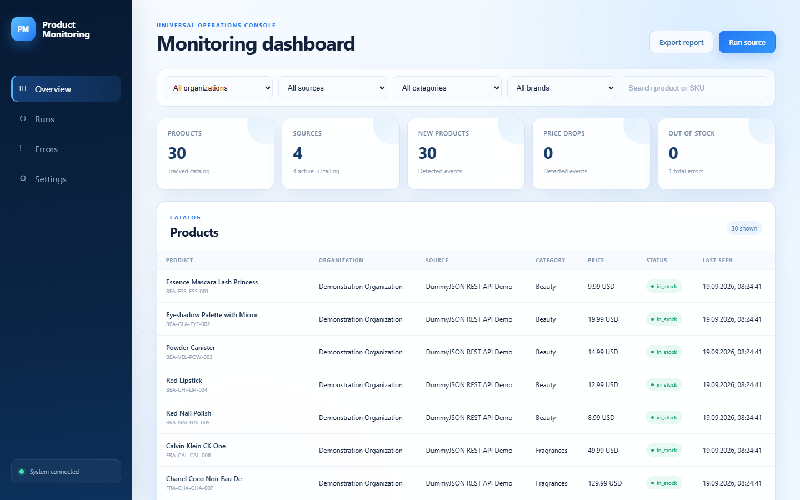

# Product Monitoring Platform


A universal platform for collecting product data from websites, APIs, JavaScript
pages, and supplier files. It normalizes catalogues into one data model, tracks
changes, stores history, sends notifications, and provides reports and a web
dashboard for multiple organizations.

The platform is not tied to books, a particular store, or one industry.
Source-specific behavior remains inside small adapters; the monitoring core is
shared by every enterprise and data source.



## What it provides

- Multiple organizations with isolated sources and monitoring policies
- HTML, REST API, JavaScript/Playwright, CSV, and XML source adapters
- A canonical product model with extensible attributes
- Price, currency, availability, URL, text, rating, and unit normalization
- Validation and per-record data-quality reporting
- Conservative cross-source product matching and deduplication
- Price, availability, product appearance, disappearance, and recovery events
- Email and Slack notifications with filters, schedules, retries, and deduplication
- Excel-ready report datasets with organization, source, category, and period filters
- Responsive web dashboard with search, history, errors, manual runs, and settings
- PostgreSQL persistence, Alembic migrations, Docker Compose, and GitHub Actions

## Architecture

```text
Organizations
     │
     ├── HTML adapter
     ├── JavaScript adapter
     ├── REST API adapter
     └── CSV / XML adapter
              │
              ▼
       ProductSource contract
              │
              ▼
 Normalize → Validate → Match → Detect changes
              │
              ▼
          PostgreSQL
       ┌──────┼─────────┐
       ▼      ▼         ▼
 Notifications  Reports  Dashboard
```

## Quick start with Docker

Requirements: Docker Desktop with Docker Compose.

```bash
git clone https://github.com/AyaulymKibasheva/product-monitoring-platform.git
cd product-monitoring-platform
docker compose up --build -d
```

Open [http://localhost:8000](http://localhost:8000).

Compose starts four services:

| Service | Purpose |
| --- | --- |
| `postgres` | Persistent PostgreSQL database |
| `migrate` | Applies pending Alembic migrations |
| `dashboard` | Serves the web interface with Gunicorn |
| `scheduler` | Runs each source on its own cron schedule |

Useful commands:

```bash
docker compose ps
docker compose logs -f dashboard scheduler
docker compose exec dashboard python main.py --source dummyjson-api --max-pages 1
docker compose down
```

Database and collected data remain in named volumes. Use `docker compose down -v`
only when you intentionally want to delete them.

## Local development

```bash
python -m venv .venv
# Windows: .venv\Scripts\activate
# Linux/macOS: source .venv/bin/activate
pip install -r requirements.txt
python -m playwright install chromium
```

Copy `.env.example` to `.env`, configure `DATABASE_URL`, then run:

```bash
alembic upgrade head
python dashboard.py
```

The dashboard address defaults to [http://127.0.0.1:8000](http://127.0.0.1:8000).
`DASHBOARD_HOST` and `DASHBOARD_PORT` can override it.

## Working with sources

The repository includes safe demonstration adapters:

| Source | Type | Purpose |
| --- | --- | --- |
| Books to Scrape | HTML | Pagination and page parsing |
| DummyJSON | REST API | Paginated structured data |
| Best Buy Products API | Live retail API | Near-real-time prices and availability |
| Steam Store | Live public API | Regional prices and discounts without a key |
| Scraping Sandbox | JavaScript | Browser-rendered infinite scrolling |
| Supplier file | CSV/XML | Local or supplier catalogue ingestion |

Run one source or every active source:

```bash
python main.py --list-sources
python main.py --source dummyjson-api --max-pages 1
python main.py --all-sources
python main.py --scheduler
```

### Connect the live Best Buy API

Create a free developer key at [developer.bestbuy.com](https://developer.bestbuy.com/),
put it in `.env`, and enable `bestbuy-live` in `config/sources.json`:

```env
BESTBUY_API_KEY=your_key_here
```

```bash
python main.py --source bestbuy-live --max-pages 1
```

The key is read only from the environment. The adapter imports actual retail
SKUs, regular and sale prices, online availability, brand, category, ratings,
images, UPC, model, and color. The source is inactive by default so deployments
without a key continue to work normally.

### Test immediately with live Steam prices

The `steam-live` source requires no account or API key and is enabled by
default. It imports current featured, top-selling, and discounted products with
regional prices:

```bash
python main.py --source steam-live --max-pages 1
```

Change `country_code` in `config/sources.json` to monitor another regional
store. Steam data is used as a live integration demonstration; production use
should follow Steam's applicable terms and rate limits.

Organizations and sources are declared in `config/sources.json`. Each source
controls its adapter, type, URL, currency, schedule, timeout, retries, rate
limits, active status, and adapter-specific settings.

### Add an organization

1. Add an organization to `config/sources.json`.
2. Define its monitoring thresholds and optional notification rules.
3. Add one or more source entries referencing that organization.
4. Reuse an existing adapter or add a new one for a different data format.

### Add an adapter

1. Implement the `ProductSource` contract.
2. Convert records into the canonical `Product` model.
3. Register the adapter factory in `src/sources/registry.py`.
4. Add local fixture-based tests for parsing, pagination, and failures.

No dashboard, database, reporting, or notification code needs source-specific
changes.

## Data and change history

The unified model contains organization/source IDs, external ID, SKU, name,
brand, category, description, current and previous prices, currency,
availability, quantity, rating, review count, URLs, image, custom attributes,
and collection time.

PostgreSQL stores current products plus price and availability history, source
runs, errors, match decisions, change events, notification rules, and delivery
attempts. Change detection covers:

- new and missing products;
- price increases and drops with absolute and percentage differences;
- out-of-stock and back-in-stock transitions;
- currency, name, category, brand, and attribute changes;
- product reappearance after a missing event.

Significance thresholds can be configured per organization and overridden per
source.

## Notifications and reports

Notification rules can filter by event type, source, category, brand, and
minimum percentage price change. Delivery supports Email and Slack with
immediate, hourly, or daily frequency. Failed deliveries retry without stopping
collection, and credentials remain in environment variables.

Generate report data with optional organization, source, product, currency, and
date filters:

```bash
python report.py --output data/report.json --organization demo-organization
node scripts/build_excel_report.mjs data/report.json report.xlsx report-preview
```

Report sections include Products, Price Changes, New Products, Back in Stock,
Out of Stock, Missing Products, Scrape History, Data Quality, and Errors.

## Database migrations

Alembic owns schema evolution:

```bash
alembic current
alembic upgrade head
```

Future model changes should include a reviewed migration revision in the same
commit.

## Quality checks

```bash
ruff check .
mypy src
python -m pytest
docker compose config --quiet
docker build -t product-monitoring-platform:test .
```

GitHub Actions executes the same lint, type checking, tests, Compose validation,
and production image build on every push and pull request. The suite currently
contains 76 tests with branch coverage enforced at 85% or higher.

## Configuration and security

Runtime settings come from environment variables. `.env.example` documents the
available values for the database, dashboard, scheduler, SMTP, and Slack.
Never commit `.env`, passwords, API keys, or webhook URLs.

## License

No license has been selected yet. Add one before distributing the project as
open-source software.
