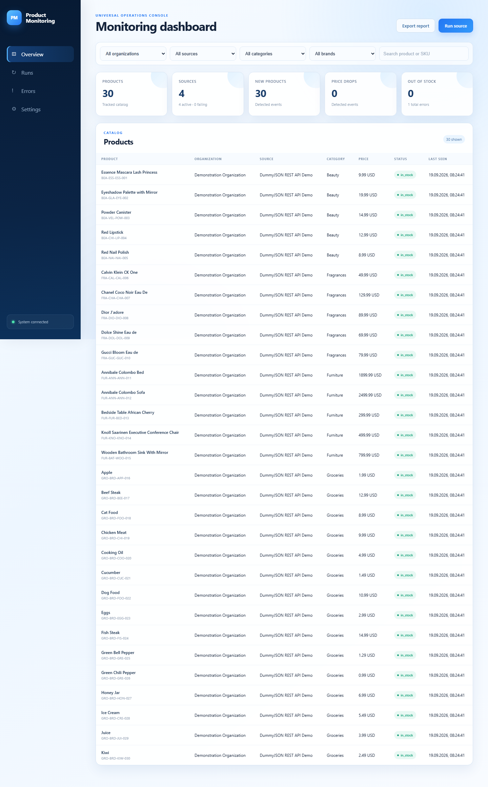

# Universal Product Monitoring & Automation Platform

The project is a source-independent platform for collecting product data from
different organizations, websites, supplier feeds, and APIs. Source-specific
logic lives only inside adapters. The core works exclusively with one canonical
`Product` model.

The included adapters demonstrate three independent source types:

- Books to Scrape — static HTML with pagination;
- DummyJSON — paginated REST API;
- Scraping Sandbox — JavaScript-rendered infinite scroll through Playwright.
- Supplier file demo — configurable CSV catalogue (the same adapter supports XML).

All are safe demonstration sources, not the domain model of the platform.



Network sources support a per-source `delay_seconds` and/or
`requests_per_second`; the stricter effective delay is applied between requests.
`--all-sources` executes independent sources concurrently on PostgreSQL, while
one failure remains isolated from the others.

## Architecture

```text
Organizations → HTML / JavaScript / API / file adapters
                            ↓
                  ProductSource contract
                            ↓
       Normalize → Validate → Match → Change detection
                            ↓
                        PostgreSQL
                   ↙         ↓         ↘
          Notifications    Reports    Dashboard
```

Adapters return a `SourceRunResult` containing normalized products and run
statistics. `SourceRegistry` selects an adapter by ID without coupling the CLI
or future scheduler to a concrete website.

Organizations and their sources are declared in `config/sources.json`. Each
source has its own adapter, type, URL, currency, schedule, timeout, retry policy,
enabled status, and adapter-specific settings. Disabling an organization also
disables all of its sources without changing application code.

Monitoring significance can be configured per organization and overridden per
source with `minimum_price_change`, `minimum_price_change_percent`, and an
optional `enabled_events` list. Source-specific rules take precedence. Runtime
timeouts, retries, backoff, and monitoring rules are persisted with the source
registry in PostgreSQL.

Before export, every normalized product passes through `ProductValidator`.
Valid products go to the main CSV; rejected records and their individual error
codes go to a neighboring `*.rejected.csv` data-quality report. Duplicate
identities are detected within each source run.

When `DATABASE_URL` is set, PostgreSQL becomes the persistent store. The schema
contains organizations, sources, current products, source-to-product links,
price and availability history, scrape runs, and per-run errors. CSV remains an
optional business-friendly snapshot.

Cross-source deduplication is deliberately conservative. Exact global product
identifiers, matching SKUs without a brand conflict, and canonical URLs can be
linked automatically. Name-only or name-and-brand matches remain separate and
are recorded for review. Distinct SKUs are treated as product variants rather
than silently merged. Match decisions and confidence scores are audited in
`product_match_events`.

Every persisted snapshot is compared with the previous state for that source.
The system records new products, price increases and drops (absolute and
percentage), currency, availability, name, category, brand, and attribute
changes. A product is marked missing only after a complete source traversal;
limited or failed runs cannot create false disappearance events. Reappearance
is recorded when the listing returns.

## Automated runs

Each source has an independent five-field cron schedule in
`config/sources.json`. Start the in-process scheduler with
`python main.py --scheduler`, or execute every active source once with
`python main.py --all-sources`. Failures are isolated: one unavailable source
is recorded as failed and does not stop the remaining sources. Every run stores
its status, start and finish timestamps, duration, counts, errors, and the last
successful source timestamp.

## Collected fields

- organization, source and external product IDs
- SKU, name, brand, category and description
- current and old price, currency, availability and quantity
- rating, review count, product URL and image URL
- extensible source-specific attributes
- UTC collection timestamp

Prices such as `$1,299.99`, `1299.99 USD`, and `1 299,99` are converted to a
`Decimal` value plus an ISO currency code. Availability uses the stable values
`in_stock`, `out_of_stock`, `preorder`, `discontinued`, or `unknown`; ratings
use a 0–5 scale; URLs are absolute and fragment-free; and timestamps are
timezone-aware UTC values. Simple measurements in attributes are converted to
stable base units (`g`, `mm`, and `ml`) while complex source text is preserved.

## Run

1. Create and activate a virtual environment.
2. Install dependencies with `pip install -r requirements.txt`.
3. Install the browser with `python -m playwright install chromium`.
4. Copy `.env.example` to `.env` if you want to change defaults.
5. Start PostgreSQL with `docker compose up -d postgres` if persistence is needed.
6. Run `python main.py --list-sources`.
7. Run one of `python main.py --source books-demo`, `--source dummyjson-api`,
   or `--source sandbox-js`.

The default output is `data/products.csv`; rejected records are written to
`data/products.rejected.csv`. Use `python main.py --max-pages 2` for
a short smoke run or `python main.py --output data/custom.csv` to choose a file.
`SOURCE_MAX_PAGES=0` means all available pages.

To add another organization or data provider, implement `ProductSource`, return
the canonical model, add its small factory entry, and declare the organization
and source in `config/sources.json`. The application pipeline does not need
source-specific changes.

To add only a new enterprise, add an organization entry with its monitoring
and notification policy, then point its source entries at an existing adapter.
To support a new data format, create one adapter implementing `ProductSource`,
register its factory in `src/sources/registry.py`, and add fixture-based tests.

## Reliability

Requests have configurable connect/read timeouts and retries with exponential
backoff for transient HTTP errors. A malformed product is logged and skipped,
so the rest of the catalogue continues. CSV output is written only after a
successful scrape and uses a stable column order.

## Reports

Stage 12 adds database-backed reporting with the same filters for every source:
organization, source, category, brand, currency, and date range. The Excel
workbook contains a summary plus Products, Price Changes, New Products, Back in
Stock, Out of Stock, Missing Products, Scrape History, Data Quality, and Errors.
Each detail sheet is an Excel table with built-in column filters.

Create the report data with `python report.py --output data/report.json`. Optional
filters include `--organization`, `--source`, `--category`, `--brand`,
`--currency`, `--from`, and `--to`. Build the workbook with
`node scripts/build_excel_report.mjs data/report.json <report.xlsx> <preview-dir>`.
PostgreSQL remains the source of truth; the report is a reproducible view.

## Notifications

Stage 13 adds organization-specific notification rules and Email/Slack delivery.
Rules can filter by event type, source, category, brand, and minimum percentage
price change. Delivery can be immediate, hourly, or daily. Every delivery is
stored in PostgreSQL, de-duplicated by event/rule/channel, and retried with
exponential backoff without interrupting product collection.

Configure `notification_channels` and `notification_rules` inside an
organization in `config/sources.json`. The included examples are deliberately
inactive. To enable them, set `active` to `true`, replace the example email,
and set the corresponding SMTP or Slack variables in `.env`. Credentials and
webhook URLs must stay in environment variables; do not put secrets in JSON.
Supported event names are `price_drop`, `price_increase`, `new_product`,
`back_in_stock`, `out_of_stock`, `product_missing`, `source_failed`, and
`data_quality_problem`. The scheduler checks queued and retryable deliveries
once per minute.

## Dashboard

Stage 14 provides one responsive web interface for all organizations and source
types. It shows platform totals, source health, product search and filters,
price and availability timelines, run history, errors, manual source runs,
report export, and organization/source monitoring settings.

Set `DATABASE_URL`, then start it with `python dashboard.py` and open
`http://127.0.0.1:8000`. The bind address and port can be changed with
`DASHBOARD_HOST` and `DASHBOARD_PORT`. Select a single source before using
**Run source**. Settings are stored in PostgreSQL and apply independently to
the selected organization or source.

## Docker deployment

Docker Compose starts PostgreSQL, applies Alembic migrations, serves the
dashboard with Gunicorn, and runs the independent scheduler:

```bash
docker compose up --build -d
docker compose ps
```

Open `http://localhost:8000`. Both PostgreSQL and dashboard have health checks;
application services wait for a healthy database and a completed migration.
Persistent database and export data use named Docker volumes. Stop services
with `docker compose down`; add `-v` only when you intentionally want to erase
all persisted data.

Useful operations:

```bash
docker compose logs -f dashboard scheduler
docker compose exec dashboard python main.py --source dummyjson-api --max-pages 1
docker compose run --rm migrate alembic current
```

For local development without Docker, install `requirements.txt`, configure
`DATABASE_URL`, apply `alembic upgrade head`, and run `python dashboard.py`.

## Database migrations

Alembic owns schema evolution. The initial revision creates organizations,
sources, products, histories, runs, errors, matching/change events, notification
rules, channels, and delivery history. Apply pending migrations with:

```bash
alembic upgrade head
```

Create future revisions only after changing the SQLAlchemy models, review the
generated SQL, and commit the revision with the model change.

## Continuous integration

GitHub Actions runs on every pull request and push to `master`. It installs the
locked Python dependencies, runs Ruff, checks types with Mypy, executes the
complete test suite with branch coverage, validates Compose, and builds the
production image. Run the same quality gate locally with:

```bash
ruff check .
mypy src
pytest
docker compose config --quiet
docker build -t product-monitoring-platform:test .
```

Runtime configuration is supplied through environment variables. Copy
`.env.example` to `.env` for local use and never commit passwords, SMTP
credentials, or Slack webhook URLs.

## Tests

Run `pytest`. Tests use local HTML fixtures and mocked HTTP responses; they do
not depend on the website being online. The suite covers parsing, pagination,
HTTP retries and failures, normalization, validation, duplicate detection,
cross-source matching, database upserts, history, change detection, missing and
returning products, source errors, and database operations. Branch coverage is
measured automatically and the suite fails below 85% total coverage.
